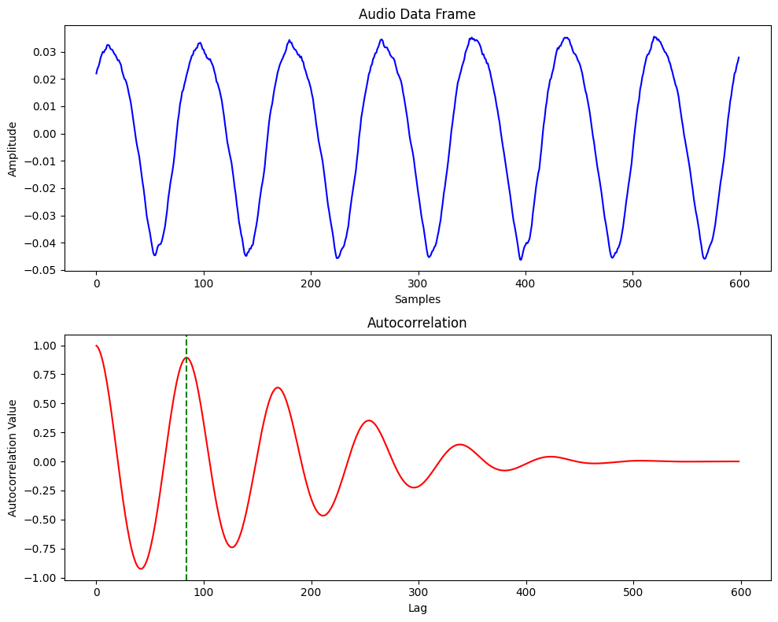
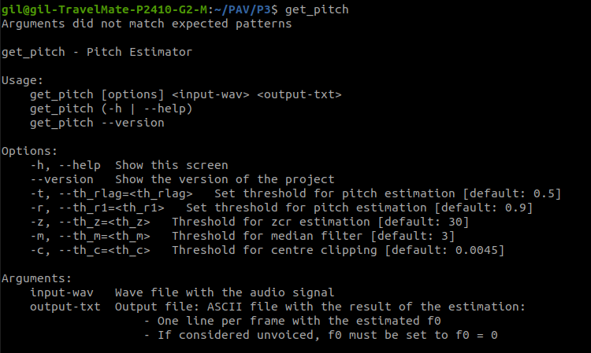
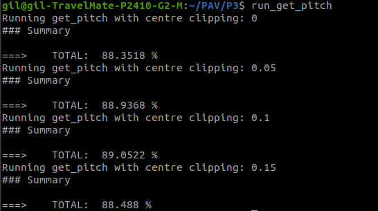

PAV - P3: estimación de pitch
=============================

Esta práctica se distribuye a través del repositorio GitHub [Práctica 3](https://github.com/albino-pav/P3).
Siga las instrucciones de la [Práctica 2](https://github.com/albino-pav/P2) para realizar un `fork` de la
misma y distribuir copias locales (*clones*) del mismo a los distintos integrantes del grupo de prácticas.

Recuerde realizar el *pull request* al repositorio original una vez completada la práctica.

Ejercicios básicos
------------------

- Complete el código de los ficheros necesarios para realizar la estimación de pitch usando el programa
  `get_pitch`.

   * Complete el cálculo de la autocorrelación e inserte a continuación el código correspondiente.

   ```cpp
    void PitchAnalyzer::autocorrelation(const vector<float> &x, vector<float> &r) const {

    for (unsigned int l = 0; l < r.size(); ++l) {
      r[l] = 0.0f;
      for (unsigned int n = 0; n < x.size()-l; ++n) {
        r[l] += x[n] * x[n+l];
      }
      r[l] /= x.size();
    }

    if (r[0] == 0.0F)
      r[0] = 1e-10; 
    }
   ```

   * Inserte una gŕafica donde, en un *subplot*, se vea con claridad la señal temporal de un segmento de
     unos 30 ms de un fonema sonoro y su periodo de pitch; y, en otro *subplot*, se vea con claridad la
	 autocorrelación de la señal y la posición del primer máximo secundario.

  

	 NOTA: es más que probable que tenga que usar Python, Octave/MATLAB u otro programa semejante para
	 hacerlo. Se valorará la utilización de la biblioteca matplotlib de Python.

   * Determine el mejor candidato para el periodo de pitch localizando el primer máximo secundario de la
     autocorrelación. Inserte a continuación el código correspondiente.

     Hemos optado por utilizar un iterador, que itera des de npitch_min a npitch_max, que son las limites humanos de pitch, pasados a numero de muestras.

     ```cpp
      vector<float>::const_iterator iR = r.begin(), iRMax = iR;

      iRMax = r.begin() + npitch_min;
      for (iR = r.begin() + npitch_min; iR < r.begin() + npitch_max; iR++) {
        if (*iR > *iRMax) iRMax = iR;
      }
      unsigned int lag = iRMax - r.begin();

      float pot = 10 * log10(r[0]);
     ```

   * Implemente la regla de decisión sonoro o sordo e inserte el código correspondiente.

En los siguientes apartados se detalla el uso de estos parámetros.

```cpp
  bool PitchAnalyzer::unvoiced(int zcr, float r1norm, float rmaxnorm, float pot) const {
    /// \TODO Implement a rule to decide whether the sound is voiced or not.
    /// * You can use the standard features (pot, r1norm, rmaxnorm),
    ///   or compute and use other ones.
    /// \DONE Rule optimized to decide if it is voiced or not

    if ((pot < -33 || r1norm < 0.96) && rmaxnorm < 0.41) return true;
    else return false;
  }
```

   * Puede serle útil seguir las instrucciones contenidas en el documento adjunto `código.pdf`.

- Una vez completados los puntos anteriores, dispondrá de una primera versión del estimador de pitch. El 
  resto del trabajo consiste, básicamente, en obtener las mejores prestaciones posibles con él.

  * Utilice el programa `wavesurfer` para analizar las condiciones apropiadas para determinar si un
    segmento es sonoro o sordo. 
	
	  - Inserte una gráfica con la estimación de pitch incorporada a `wavesurfer` y, junto a ella, los 
	    principales candidatos para determinar la sonoridad de la voz: el nivel de potencia de la señal
		(r[0]), la autocorrelación normalizada de uno (r1norm = r[1] / r[0]) y el valor de la
		autocorrelación en su máximo secundario (rmaxnorm = r[lag] / r[0]).

		Puede considerar, también, la conveniencia de usar la tasa de cruces por cero.

    

	    Recuerde configurar los paneles de datos para que el desplazamiento de ventana sea el adecuado, que
		en esta práctica es de 15 ms.

      - Use el estimador de pitch implementado en el programa `wavesurfer` en una señal de prueba y compare
	    su resultado con el obtenido por la mejor versión de su propio sistema.  Inserte una gráfica
		ilustrativa del resultado de ambos estimadores.
     
    

		Aunque puede usar el propio Wavesurfer para obtener la representación, se valorará
	 	el uso de alternativas de mayor calidad (particularmente Python).
  
  * Optimice los parámetros de su sistema de estimación de pitch e inserte una tabla con las tasas de error
    y el *score* TOTAL proporcionados por `pitch_evaluate` en la evaluación de la base de datos 
	`pitch_db/train`..


Ejercicios de ampliación
------------------------

- Usando la librería `docopt_cpp`, modifique el fichero `get_pitch.cpp` para incorporar los parámetros del
  estimador a los argumentos de la línea de comandos.
  
  Esta técnica le resultará especialmente útil para optimizar los parámetros del estimador. Recuerde que
  una parte importante de la evaluación recaerá en el resultado obtenido en la estimación de pitch en la
  base de datos.

  * Inserte un *pantallazo* en el que se vea el mensaje de ayuda del programa y un ejemplo de utilización
    con los argumentos añadidos.

    

- Implemente las técnicas que considere oportunas para optimizar las prestaciones del sistema de estimación
  de pitch.

  Entre las posibles mejoras, puede escoger una o más de las siguientes:

  * Técnicas de preprocesado: filtrado paso bajo, diezmado, *center clipping*, etc.
  * Técnicas de postprocesado: filtro de mediana, *dynamic time warping*, etc.
  * Métodos alternativos a la autocorrelación: procesado cepstral, *average magnitude difference function*
    (AMDF), etc.
  * Optimización **demostrable** de los parámetros que gobiernan el estimador, en concreto, de los que
    gobiernan la decisión sonoro/sordo.
  * Cualquier otra técnica que se le pueda ocurrir o encuentre en la literatura.

  Encontrará más información acerca de estas técnicas en las [Transparencias del Curso](https://atenea.upc.edu/pluginfile.php/2908770/mod_resource/content/3/2b_PS%20Techniques.pdf)
  y en [Spoken Language Processing](https://discovery.upc.edu/iii/encore/record/C__Rb1233593?lang=cat).
  También encontrará más información en los anexos del enunciado de esta práctica.

  Incluya, a continuación, una explicación de las técnicas incorporadas al estimador. Se valorará la
  inclusión de gráficas, tablas, código o cualquier otra cosa que ayude a comprender el trabajo realizado.

  También se valorará la realización de un estudio de los parámetros involucrados. Por ejemplo, si se opta
  por implementar el filtro de mediana, se valorará el análisis de los resultados obtenidos en función de
  la longitud del filtro.

  > **Filtrado lineal:**
  > Hemos analizado visualmente como afecta a la deteccion de pitch filtrados paso bajos y paso altos, y no hemos visto ninguna mejora significativa, asy que no lo vamos a implenentar.

En esta grafica podemos ver como prácticamente no hay diferencia entre la autocorrelación original, y aplicando filtros paso alto fc = 50 Hz y paso bajo fc = 2000 Hz.
   


  > **Centre clipping:**
  > Hemos implementado centre clipping sin offset, ya que nos ha mejorado los resultados.

```cpp
  vector<float>::iterator iX;
  vector<float> f0;
  for (iX = x.begin(); iX + n_len < x.end(); iX = iX + n_shift) {
    // Calculate the maximum absolute value within the current frame
    float max_sample = *max_element(iX, iX + n_len, [](float a, float b) {
        return abs(a) < abs(b);
    });
    // Calculate the clip_threshold as half of the maximum absolute value
    float clip_threshold = 0.06 * abs(max_sample);

    // Apply central clipping
    for (int i = 0; i < n_len; ++i) {
      // Clip samples symmetrically around the center
      float sample = *(iX + i);
      if (abs(sample) < clip_threshold){
          *(iX + i) = 0;
      }
    }
    
    float f = analyzer(iX, iX + n_len);
    f0.push_back(f);
  }
```

En la siguiente imagen podemos ver como el valor del centre clipping afecta al resultado total.



  > **Filtro de mediana:**
  > Tambien hemos implementado un filtro de mediana para el postprocessado.

```cpp
  vector<float> filtered_f0;
  int filter_window_size = 5; // Adjust this window size as needed

  for (int i = 0; i < f0.size(); ++i) {
      // Determine the range of indices for the current window
      int start_index = max(0, i - filter_window_size / 2);
      int end_index = min(static_cast<int>(f0.size()) - 1, i + filter_window_size / 2);
      
      // Create a copy of the pitch values within the window
      vector<float> window_pitch(f0.begin() + start_index, f0.begin() + end_index + 1);
      
      // Sort the window_pitch vector to find the median
      std::nth_element(window_pitch.begin(), window_pitch.begin() + window_pitch.size() / 2, window_pitch.end());
      
      // Get the median value
      float median_pitch = window_pitch[window_pitch.size() / 2];

      // This condition improves the pitch estimation, reduces the MSE fine errors,
      // but reduces the overall result
      // if (median_pitch - f0[i] < threshold1) {
      //   median_pitch = f0[i];
      // }
      
      // Store the median value in the filtered_f0 vector
      filtered_f0.push_back(median_pitch);
  }
```

En esta captura de pantalla vemos como afectan las diferentes longitudes a el resultado final. Tambien hemos implementado que si la diferencia entre el f0 filtrado y el f0 original es mas grande que un threshold, escoja el f0 original. Pero tampoco mejorava el resultado final.


  > **Cepstrum:**
  > Hemos echo un analisis en profundidad del algoritmo del cepstrum.

Primero, en los ficheros `vis_voiced.ipynb` y `vis_unvoiced.ipynb` de la carpeta creada para visualizacion de graficas `vis`, hemos podido analizar, paso a paso, como encontrar los coefficientes cepstrales. En esta primera grafica podemos ver una comparativa de los coeficientes cepstrales de una trama sorda, y una sonora. Ademas, en el fichero `cepstrum.ipynb`, tambien en `vis`, se puede analizar todo el proceso, de manera mas efectiva, y desplazando la trama de interés para todas las posiciones.


Podemos ver claramente la diferenciacion entre sordo y sonoro. 

Viendo estos resultados creímos conveniente programar este algoritmo. A continuación podemos ver sus funciones principales.

```cpp
  vector<float> PitchAnalyzer::cepstral_analysis(const vector<float> &x) const {

    vector<float> x_corrected = x;

    // Add zeros to have a length multiple of 2
    size_t next_power_of_2 = pow(2, ceil(log2(x_corrected.size())));
    size_t num_zeros = next_power_of_2 - x_corrected.size();
    x_corrected.insert(x_corrected.end(), num_zeros, 0.0f);

    // Perform the fft on the input signal
    ffft::FFTReal<float> fft(x_corrected.size());
    float x_[x_corrected.size()];
    for (unsigned int i = 0; i < x_corrected.size(); ++i) 
      x_[i] = x_corrected[i];
    float x_fft[x_corrected.size()]; // Complex FFT output
    fft.do_fft(x_fft, x_);
    
    // Compute the logarithm of the autocorrelation
    for (unsigned int i = 0; i < x_corrected.size(); ++i) {
      float mod = sqrt(x_fft[i] * x_fft[i]);
      x_fft[i] = log(mod + 1e-10); // Add a small value to avoid log(0)
    }

    // Perform inverse Fourier transform to obtain the cepstrum
    float cepstrum_[x_corrected.size()];
    fft.do_ifft(x_fft, cepstrum_);
    fft.rescale(cepstrum_);

    vector<float> cepstrum;
    cepstrum.resize(x_corrected.size());
    for (int i = 0; i < x_corrected.size(); ++i)
      cepstrum[i] = cepstrum_[i];

    return cepstrum;
  }
```

En `cepstral_analysis` calculamos los coeficientes del cepstrum a partir de la libreria fft que se nos proporciona.

```cpp
  tuple<float, unsigned, float> PitchAnalyzer::get_results(const vector<float> &cepstrum) const {
    // Find the peak in the cepstrum (excluding the DC component)
    float max_val = -10000;
    unsigned int max_idx = 0;
    float max_val_zero = 0;
    for (unsigned int i= 0; i < 10; ++i) {
      if (cepstrum[i] > max_val_zero) {
        max_val_zero = cepstrum[i];
      }
    }
    for (unsigned int i = 40; i < 400; ++i) {
      if (cepstrum[i] > max_val) {
        max_val = cepstrum[i];
        max_idx = i;
      }
    }

    return make_tuple(max_val, max_idx, max_val_zero);
  }
```

En `get_results` analizamos el vector de coeficientes cepstrales y devolvemos el vamor maximo de los 10 primeros coeficientes (creíamos que era inportante, pero no lo acabamos utilizando), el valor maximo dentro del rango de pitch, y su respectivo indice. Solo utilizamos el indice, ya que es la estimacion del pitch.


```cpp
  if (unvoiced(zcr, r[1]/r[0], r[lag]/r[0], pot))
    return 0;
  else
    return (float) samplingFreq/(float) get<1>(results);
```

No obstante, los resultados no han sido los esperados, y no nos ha proporcionado ninguna mejora.


  > **AMDF:**
  > Tambien se ha intentado mejorar el resultado final a partir de el algoritmo AMDF.

Se ha programado la siguiente funcion para utilizar el AMDF.

```cpp
  void PitchAnalyzer::mdf(const vector<float> &x, vector<float> &r) const {

    for (unsigned int l = 0; l < r.size(); ++l) {
      r[l] = 0.0f;
      for (unsigned int n = 0; n < x.size()-l; ++n) {
        r[l] += abs(x[n] - x[n+l]);
      }
      r[l] /= x.size();
    }

    if (r[0] == 0.0F) //to avoid log() and divide zero 
      r[0] = 1e-10; 
  }
```

Es muy parecida a la función de la autocorrelación, pero restando y no multiplicando. Y para encontrar el minimo. 

```cpp
  vector<float>::const_iterator iD = d.begin(), iDMin = iD;

  iDMin = d.begin() + npitch_min;
  for (iD = d.begin() + npitch_min; iD < d.begin() + npitch_max; iD++) {
    if (*iD < *iDMin) iDMin = iD;
  }
  unsigned int lag_d = iDMin - d.begin();
```

También, muy parecido a la autocorrelación. Sin embargo, de nuevo, no nos ha mejorado el resultado.


Es posible que estos resultados sean por algun error en la implementación de el algoritmo, ya que es muy parecido a la autocorrelación, pero da un resultado muy lejano.

Ademas en el fichero `vis_autocorr.ipynb` hemos analizado autocorrelación y amdf, y deberian dar resultados muy parecidos.

  > **Optimización de los resultados:**
  > Utilizando docopt y un script, `optimization.sh`, se han optimizado las diferentes constantes y umbrales. 

```bash
GETF0="get_pitch"

# Array of threshold values
th_rlags=(0.39 0.4 0.41)
th_r1s=(0.94 0.96 0.98)
th_zs=(32 33 34 35)
th_ms=(1 3)
th_cs=(0.0043 0.0045 0.0047 0.0049)

# Iterate over each combination of thresholds
for th_r1s in "${th_r1s[@]}"; do
    for th_rlags in "${th_rlags[@]}"; do
        for th_zs in "${th_zs[@]}"; do
            for th_ms in "${th_ms[@]}"; do
                for th_cs in "${th_cs[@]}"; do 
                    echo "Running get_pitch with thresholds: $th_r1s, $th_rlags, $th_zs, $th_ms and $th_cs"
                    
                    for fwav in pitch_db/train/*.wav; do
                        ff0=${fwav/.wav/.f0}
                        # echo "$GETF0 -t $threshold1 $fwav $ff0 ----"
                        $GETF0 -t $th_rlags -r $th_r1s -z $th_zs -m $th_ms -c $th_cs $fwav $ff0 > /dev/null || ( echo -e "\nError in $GETF0 -t $th_r1s -t $th_rlags -z $th_zs -m $th_ms -c $th_cs $fwav $ff0" && exit 1 )
                    done
                    pitch_evaluate pitch_db/train/*.f0ref
                done
            done
        done
    done
done

exit 0
0
```

Una vez encontrado, mas o menos, los valores de los parametros óptimos, procedemos ha hacer una optimización mas precisa. Este es el codigo de la función `unvoiced`.

```cpp
  if ((pot < -th_z || r1norm < th_r1) && rmaxnorm < th_rlag) return true;
    else return false;

```

Aquí podemos ver los parametros mas óptimos.

  > **Zero Crossing Rate:**
  > Se ha implementado tambien el zero crossing rate, para classificar entre sordo y sonoro.

```cpp
  int zcr = 0;
  for (int i = 1; i < x.size(); i++) {
      zcr += (x[i] * x[i-1] < 0);
  }
```

Aunque finalmente, para el resultado final tampoco lo hemos tenido en cuenta, ya que no conseguiamos mejorar el porcentaje.

 > **Analisis final:**
 > Finalmente, el mejor resultado nos ha salido con el metodo de la autocorrelación.

Tenemos en cuenta potencia, r[lag]/r[0] y r[1]/r[0] con valores *33*, *0.41* y *0.96* respectivamente.

Evaluación *ciega* del estimador
-------------------------------

Antes de realizar el *pull request* debe asegurarse de que su repositorio contiene los ficheros necesarios
para compilar los programas correctamente ejecutando `make release`.

Con los ejecutables construidos de esta manera, los profesores de la asignatura procederán a evaluar el
estimador con la parte de test de la base de datos (desconocida para los alumnos). Una parte importante de
la nota de la práctica recaerá en el resultado de esta evaluación.
